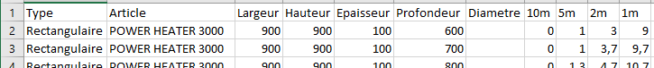
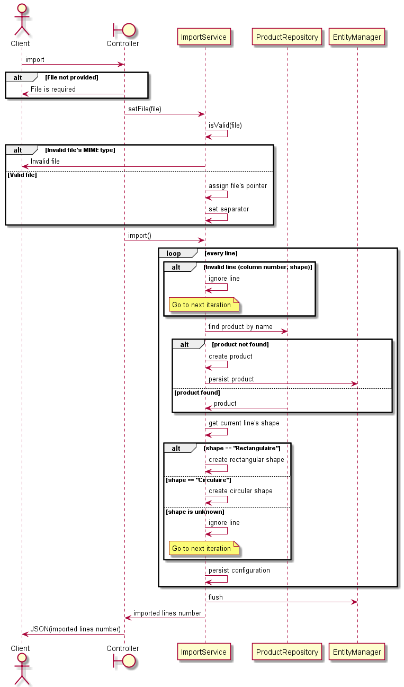
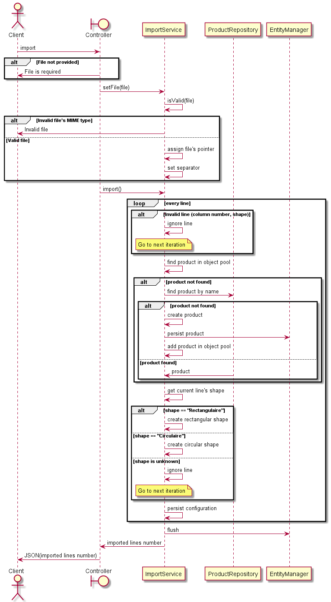
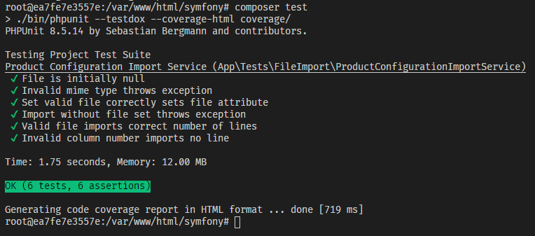
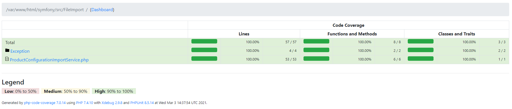

# API Exemple - SF5 / API Platform / Docker-compose

## Pile applicative

Cette application d'exemple intègre 4 conteneurs :

- NGINX (frontal)
- PHP
- MySQL
- PhpMyAdmin

## Configuration

Créer un fichier `.env.local` avec les variables suivantes (remplacer les `xxxxxx` par les valeurs de configuration de votre environnement) :

```env
# pour Doctrine
DATABASE_URL=mysql://root:xxxxxxxxxxxxxxxx@db:3306/xxxxxxx?serverVersion=8.0

# Pour le conteneur MySQL
MYSQL_HOST=%
MYSQL_ROOT_PASSWORD=xxxxxxxxxxxxxxxx
```

## Lancer la pile applicative avec Docker-compose

Dans l'environnement de développement :

```bash
docker-compose -f docker-compose.yml -f docker-compose.development.yml up -d
# ou bien
composer start-dev
```

Tester l'accès sur le port exposé par NGINX, dans notre cas `8500` : [http://localhost:8500](http://localhost:8500).

> Evolution possible : support HTTPS ! Piste à explorer : Serveur [Caddy](https://caddyserver.com/) à la place d'un serveur NGINX ([image Docker caddy](https://hub.docker.com/_/caddy))

## Débugger avec VSCode

Le Dockerfile du conteneur PHP contient 2 stage builds : un par défaut, qu'on peut utiliser en production, et un supplémentaire, `php_dev`, qui vient ajouter l'installation de XDebug.

La configuration docker-compose de développement vient donc installer XDebug dans le conteneur PHP, et définir le port sur lequel se brancher (dans notre exemple, fichier `docker-compose.development.yml`, le port défini est 25555).

Depuis VSCode, avec l'extension [PHP Debug](https://marketplace.visualstudio.com/items?itemName=felixfbecker.php-debug) installée, déclencher la création d'un fichier `launch.json` avec le panneau de debug.

Ensuite, il faut définir le port XDebug conformément à ce qu'on a défini avec Docker-compose, et mapper l'arborescence des fichiers locaux sur l'arborescence de fichiers du conteneur PHP.

Exemple de configuration `launch.json` :

```json
{
  "name": "Listen for XDebug",
  "type": "php",
  "request": "launch",
  "port": 25555,
  "pathMappings": {
    "/var/www/html/symfony": "${workspaceRoot}"
  }
}
```

> Le fichier `launch.json` est volontairement exclu de ce repository pour éviter de fournir un fichier inutile aux utilisateurs d'un autre IDE

## Import de configurations

Nous disposons d'un fichier CSV avec une liste de configurations à importer.

Le but est ici d'introduire la fonctionnalité d'import pour que notre API puisse réceptionner un fichier et créer les configurations associées.

### Contenu & structure du fichier : premiers constats



- Nous disposons de 11 colonnes
- La première colonne peut contenir "Rectangulaire" ou "Circulaire". Notre import devra donc créer dynamiquement une configuration rectangulaire ou circulaire selon le type de la ligne en cours de traitement
- Toujours concernant le type, on remarque que les configurations rectangulaires précisent largeur et hauteur, tandis que les configurations circulaires ne spécifient que le diamètre
- L'article représente ici notre `Product`, il faudra donc vérifier si l'article existe déjà, et le créer si ce n'est pas le cas. Sinon, prendre sa référence afin d'éviter de créer un doublon
- Notre fichier contient environ 1000 lignes. Il faudra prévoir, au mieux, une solution scalable permettant de traiter des fichiers plus conséquents, si besoin

### De quoi avons-nous besoin ?

- D'un point d'entrée (endpoint) pour réceptionner la requête et le fichier : un contrôleur par exemple, avec la méthode POST
- D'un moyen de vérifier l'existence d'un produit : un `ProductRepository` par exemple
- D'un service d'import de fichier, auquel on pourra passer le fichier réceptionné. Ceci nous permettra d'éviter de réunir toute la logique dans le contrôleur. Par la suite, on pourra refactoriser ce service pour une meilleure séparation des responsabilités

Concernant le fichier lui-même :

- Il faudrait pouvoir valider son format, ou encore son type MIME

Concernant chaque ligne du fichier :

- Il pourrait être utile de s'assurer que la ligne contient le bon nombre de colonnes, afin de valider que la quantité de données attendue est correcte

### Identifions les premières responsabilités => premiers diagrammes

Les points identifiés ci-dessus nous permettent d'en extraire quelques responsabilités :

- Validation du fichier
- Validation du nombre de colonnes d'une ligne
- Aller chercher un produit
- Créer un produit avec son nom
- Persister/sauvegarder le produit
- Créer une configuration rectangulaire
- Créer une configuration circulaire
- Affecter les champs à la configuration créée
- Persister/sauvegarder la configuration

### Validation du fichier

Le service d'import, dans un premier temps, peut se charger de valider le fichier passé en paramètre.

Idéalement, on pourrait donc disposer d'une méthode `isValid($file)` qui nous renverrait un booléen. On pourrait ensuite choisir de lever une exception en fonction du retour de cette méthode.

Par ailleurs, la validation du fichier pourrait intervenir au moment où on veut affecter le fichier à importer au service d'import.

Nous pourrions donc imaginer 3 méthodes :

- setFile($file) : assigne le pointeur vers le fichier, pour éviter de charger l'ensemble du fichier en mémoire. On pourra ainsi itérer sur chaque ligne
- isValid($file) : valide le type Mime du fichier selon ce qui est attendu pour l'import
- import() : lance l'import

> Note : pour valider le type MIME du fichier dans le cadre d'une application Symfony, on devra installer le composant `symfony/mime` : `composer require symfony/mime`

### Validation du nombre de colonnes d'une ligne

Pour chaque ligne, il faudrait être capable de vérifier qu'on a le bon nombre de colonnes.

Ainsi, on pourrait par exemple ajouter un nombre de colonnes attendues, dans notre service d'import.

Ce nombre de colonnes peut se représenter par un attribut par exemple.

Par ailleurs, pour bien parser notre ligne, il nous faudrait un séparateur de champ. Ici, le fichier fourni nous indique que nous avons des `;`.

### Aller chercher un produit

Dans la plupart des applications utilisant un framework, on peut interagir avec les données au travers d'une couche de services, composée de divers `Repository`.

Dans notre cas, le `ProductRepository` semble tout indiqué pour nous permettre de récupérer un produit à partir de son nom.

### Créer un produit avec son nom

Les choix d'implémentation peuvent varier concernant la création d'un enregistrement. On pourrait :

- Créer une méthode dans le `ProductRepository`, qui créerait un produit à partir de son nom. Mais cette méthode serait très spécifique
- Ajouter une méthode dans le service d'import, qui pourrait nous permettre de créer un produit. Dans ce second cas, on aurait probablement besoin d'un gestionnaire d'entités pour gérer la persistence des données

### Persister/sauvegarder le produit

Comme indiqué précédemment, un gestionnaire d'entités semble tout indiqué pour persister une entité.

### Créer une configuration rectangulaire/circulaire

Cette problématique est créationnelle. Il va probablement être possible de la régler avec un design pattern créationnel :)

### Affecter les champs à la configuration créée

Cette responsabilité est, quelque part, un peu liée à l'instanciation de la configuration. Il faudra déterminer comment implémenter cette partie également, et si on décide de la lier à la précédente (Builder par exemple) ou la séparer (une factory à part, et un service chargé d'initialiser les champs ?).

### Persister/sauvegarder la configuration

==> Gestionnaire d'entités (persist, flush)

### Première version




## Problèmes de la première version

### Au niveau des classes

On voit clairement, sur le diagramme de classes, que le service d'import est étroitement couplé aux différentes implémentations concrètes d'une configuration.

Ceci peut être un problème à l'avenir, car l'ajout d'une configuration concrète impliquera de retoucher le service d'import.

Il pourrait être plus convenable de disposer d'un objet communiquant avec le service d'import et permettant de créer tel ou tel type de configuration. Ce genre de problématique, encore une fois, nous rapproche d'une factory ou d'un builder par exemple.

Par ailleurs, la séparation de cette responsabilité dans une partie de l'application à part entière permet l'écriture de tests unitaires plus aisée, car cette partie, et uniquement celle-là, pourrait être testée en isolation totale des autres unités de l'application.

### Au niveau du processus

On s'aperçoit également, dans le premier diagramme de séquence, que le service d'import a beaucoup de choses à faire.

Ensuite, concernant la récupération/création d'un produit, nous allons faire face à un problème de taille : un `flush` unique après la boucle risque de persister autant de produits que de produits créés car non trouvés.

Exemple :

```php
$product = $this->productRepository->findOneBy(['name' => $line[1]]);
if ($product === null) {
  $product = new Product();
  $product->setName($line[1]);
  $this->em->persist($product);
}
```

Ici, nous persistons le produit mais nous ne déclenchons pas le `flush` du gestionnaire d'entités.

Ainsi, si nous venons de persister un produit, vu qu'il ne se trouve pas encore en base de données, alors à la prochaine itération, nous allons **recréer** un produit, le persister également, etc...

Il pourrait donc être utile de retenir ce produit au niveau du service d'import, et ce à double titre :

- Eviter la création de doublons
- Eviter les requêtes en base de données pour chercher des produits, à chaque itération. Si nous disposons d'une copie d'un produit, déjà utilisé, dans notre instance, alors nous économisons une requête SQL de récupération

> En réalité, ce besoin se rapproche d'un design pattern : **Object Pool**. Un pool d'objets permet de retenir des instances d'objet afin d'éviter d'avoir à les instancier/détruire/récupérer de nouveau, au besoin

## Pool d'objets de produits

Dans le service d'import, on peut déclarer le tableau qui contiendra nos objets :

```php
class ProductConfigurationImportService
{
  // ...
  private $products = []; // Product objects pool
  // ...
}
```

Puis réorganiser notre code pour aller :

- Chercher le produit dans le pool
- S'il n'existe pas dans le pool, alors aller le chercher dans la base de données
- S'il n'existe pas dans la base de données, alors le créer

> On en profite pour externaliser ce code dans une nouvelle méthode, `getOrCreateProduct`, consommée par la méthode d'import de manière interne. Cela sépare mieux les responsabilités, et rend la méthode d'import plus lisible. Le nommage de cette méthode est important ici, car nous voulons rester explicites sur la responsabilité de cette méthode. `getProduct`, par exemple, pourrait cacher involontairement le fait que la méthode est capable de créer un nouveau produit

```php
/**
 * Tries to get the product from the object pool or the database.
 * If none is returned, it creates a product in the database and puts it in the object pool
 *
 * @param string $name
 * @return Product
 */
private function getOrCreateProduct(string $name): Product
{
  if (!isset($this->products[$name])) {
    $product = $this->productRepository->findOneBy(['name' => $name]);
    if ($product === null) {
      $product = new Product();
      $product->setName($name);
      $this->em->persist($product);
      $this->products[$name] = $product;
    }
  } else {
    $product = $this->products[$name];
  }

  return $product;
}
```

Vu qu'on cherche un produit par son nom, on en profite pour associer un nom de produit (en tant que clé) à l'entité correspondante. D'autres implémentations sont possibles bien sûr.

Et le diagramme de séquence mis à jour :



> Note : dans le cadre d'une application Symfony, si vous voulez tester plusieurs fois à la suite, la fonctionnalité ne gérant pas les doublons de configurations, pour éviter de créer des milliers de configurations, vous pouvez vider votre base de données avant de relancer un import. Pour ce faire, vous pouvez par exemple installer le bundle de fixtures (données de tests), avec `composer require --dev orm-fixtures`, puis vider la méthode `load` et lancer la création de fixtures : la commande va donc vider la base de données, et ne rien créer. Vous pouvez ensuite relancer votre import sur une base vierge

## Ecriture des tests pour la première version de la fonctionnalité

L'écriture des tests permet de valider le fonctionnement attendu.

Par ailleurs, de prochaines modifications de notre code pourrait casser le fonctionnement initial : les tests ne passeront plus et nous serons automatiquement prévenus.

> Egalement, dans le cadre d'un processus de déploiement continu, un déploiement automatique peut être évité si un test ne passe plus !

Dans un premier temps, nous allons installer `PHPUnit` dans notre application, ou bien tout autre outil de tests adapté à votre langage/plateforme : `composer require symfony/phpunit-bridge --dev`.

Les tests réalisés dans un premier temps sont les suivants :



Un script composer a été ajouté dans le fichier `composer.json`, afin de formater la sortie et générer un rapport de couverture de code :



> Note : Il n'est pas nécessaire de viser 100% de couverture de code. Ici, les tests définis permettent de couvrir l'ensemble du code de la fonctionnalité, mais il est tout à fait possible, lors de la refactorisation qui va être effectuée, d'avoir un peu moins

### Concernant l'implémentation des tests

Les exemples de tests donnés ici s'effectuent en totale isolation : les dépendances du service ont été **mockées** (ou simulées) car les tests doivent se concentrer uniquement sur la fonctionnalité à tester.

Par ailleurs, des fichiers _exemples_, ou références, ont été déposés pour pouvoir tester notre import "à la volée".

Une autre stratégie aurait également pu s'appuyer sur une base de données locale (SQLite par exemple, non versionnée).

Il existe de nombreuses façons d'écrire les tests. L'opération suivante va être de refactoriser l'implémentation initiale de notre fonctionnalité. Les tests seront donc forcément impactés par cette réécriture. Nous allons voir comment mieux séparer notre code, tenter d'appliquer les principes SOLID pour assurer la meilleure maintenabilité possible, et, quand nous le jugerons nécessaire, appliquer également un ou plusieurs design patterns.

Dans tous les cas, le fait de garder une suite de tests pour notre fonctionnalité nous permettra de valider que le comportement est conforme à ce qui est attendu.
